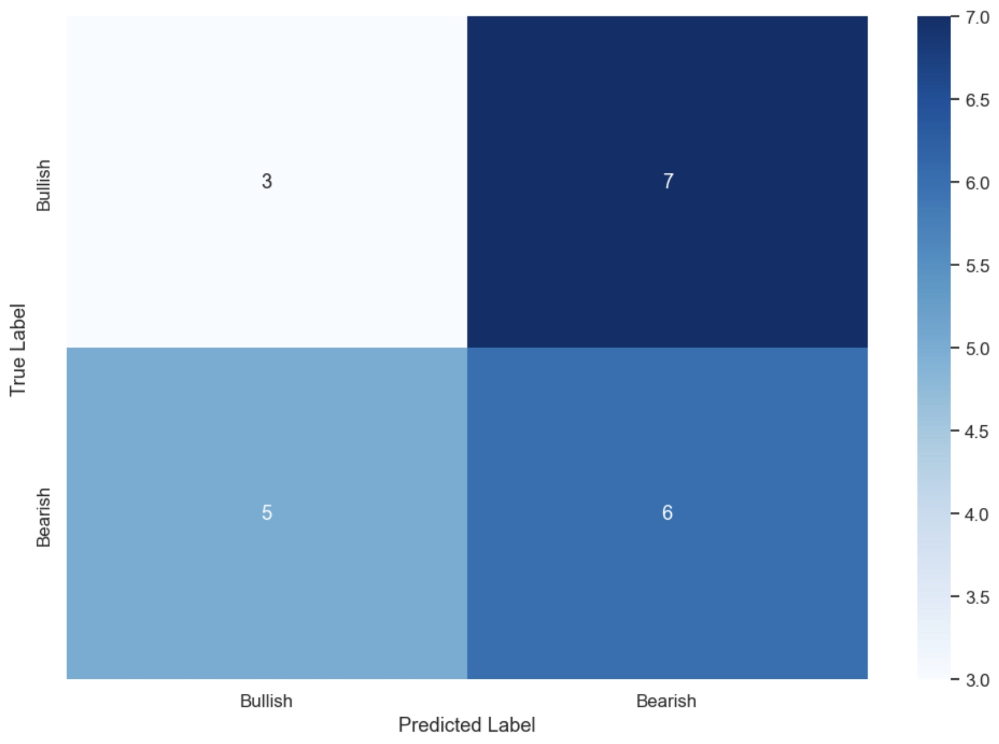
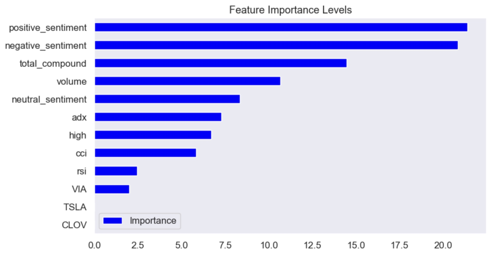
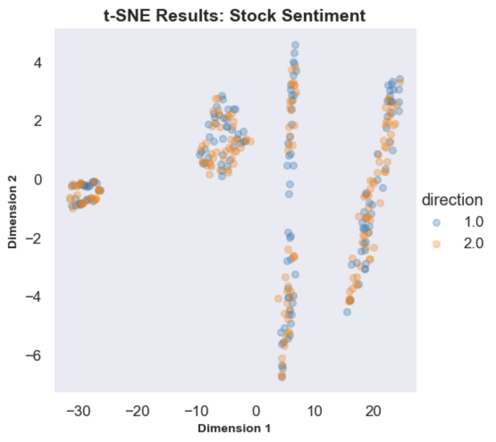

# Hi! This project is to analyze WallStreetBets post sentiment and model stock movement predictions.


# Index

* [Overview](#Overview)
* [Exploratory Data Analysis](#Visualizations)
* [Classification Modeling](#Modeling)
* [Next Steps](#Next-Steps)
* [Repository Structure](#Repository-Structure)
* [Reproducibility](#Reproducibility)

# Important Links

* [Slideshow Presentation](https://github.com/kai-cansler/wsb_sentiment_analysis_stock_prediction/blob/main/presentation.pdf)
* [Sentiment EDA Notebook](https://github.com/kai-cansler/wsb_sentiment_analysis_stock_prediction/blob/main/notebook.ipynb)
* [Classification Modeling Notebook](https://github.com/kai-cansler/wsb_sentiment_analysis_stock_prediction/blob/main/model.ipynb)

# Overview

In the fast paced growth of easy access to individual brokerage accounts the number of retail traders have grown immensely in the stock market. Retail traders now find communities online to share ideas on new stock picks. We want to understand how retail trader sentiment on popular networks effect stock prices. I will look at WallStreetBets specifically to understand sentiment and to predict whether the stock price went up or down with classification modeling.

Steps:
Data Cleaning
Exploratory Data Analysis
Sentiment Analysis
Classification Modeling

# Business Understanding

A Small Boutique investment firm MarketProphit is looking to understand the effect retail investors have on the market. MarketProphit wants to manage their risk in their trading strategy to account for the market influence retail investors possess. We want to look at WallStreetBets subreddit to identify opportunities for entry and exit of stocks based on the increase in volume from posts.

# Data Understanding

We got the sentiment data from reddit_wsb.csv from [WallStreetBets Kaggle](https://www.kaggle.com/datasets/gpreda/reddit-wallstreetsbets-posts) dataset. The data contains 50,069 posts. The dataset contains title and body text data, url, number of comments, timestamp, and score. We also use [AlphaVantage](https://www.alphavantage.co/documentation/) API to collect stocks financial data and technical indicators for historic 20 years.

1. WallStreetBets Post Data (reddit_wsb.csv)
    - Each line of this file after the header row represents one rating of one movie by one user and are on a 5-star scale.
    - Columns: userId,movieId,rating,timestamp
2. Stock Ticker List (tickers.csv)
    - Contains list of Stock tickers and resent financials. We use Symbol to identify them in the WallStreetbets Post Analysis
    - Columns: Symbol,Name,Last Sale,Net Change,% Change,Market Cap,Country,IPO Year,Volume,Sector,Industry
3. AlphaVantage
    - TIME_SERIES_DAILY: Used to collect historic 20 years of open, close, volume, and high data for each stock.
    - RSI, CCI, and ADX: Used to collect historic 20 years of technical indicator data for each stock. 

# Visualizations

We learned alot about our retail investors and their posts on WallStreetBets. The Title text contained more positive sentiment than negative sentiment where as the Body text contained slightly higher negative sentiment that positive sentiment. Being an online forum there is large usage of memetic language that needs to be accounted for such as "moon", "tendies", and "bagholder". Many posts contain Daily and Weekly recommendations to look for and will be important to look for to manage our risk. Retail investors also higher average negative sentiment toward financial institutions, brokerages, and some news outlets.


# Modeling

We explored several classification models.
1. LogisticRegressionClassifier
2. KNNClassifier
3. DecisionTreeClassifier
4. RandomForestClassifier
5. GradientBoostingClassifier

For the final classification model, we used GradientBoostingClassifier (GB) with Price, Technicals, and Sentiment data. It performed on par with RandomForest with high F1 score. GradientBoosting was chosen over RandomForest for use of gradient descent and residuals to optimize and reduce bias. It is more flexible, since you can use any differentiable loss function or regularization in fitting the data. 







# Conclusion:
In our effort to build a classification model we tested various classification models. Each approach had its own pros and cons. Our final model performed with a final F1-score of 42.06% after hyperparameter tuning over the baseline.

Our Feature importances showed the sentiment analysis over technical data ADX, RSI, and CCI to split the most observations for classification. The model containing only Price and Technicals data had a F1-score of 40.8% which is lower than our target based on distribution of our price movement direction feature.

# Analysis
It is important to consider what retail investors are doing and their inherent effect they have on the market. Our model indicates that predicting the next days price movement based on post sentiments of the previous day will not perform better than predicting the stock will go down 100% of the time. This is not a winning strategy. Retail investors consistently communicate with each other on their trade decisions and recommend stocks to look out for. These sentiments can be a important feature to add to our trading model and overall strategy with the addition of sentiment on other platforms, subreddits, and news outlets.

# Recommendation
1. From our EDA we learned that retail investors have positive sentiment in posts around daily and weekly discussions and recommendations. We want to observe and monitor these posts to look for any indicators on market movement.
2. Within WSB posts we learned about the sentiment of popular online words such as Moon, Hold, and Rocket. My recommendation is to analyze posts for these sentiments to make informed decisions on what retail investors are doing.
3. Negative Sentiment is an important feature when it comes to modeling stock price movement. My recommendation is to utilize the model to understand fear and bearish sentiment on stocks for market opportunities to either buy at a discount or short trade.


# Next steps
Collect and test on larger dataset containing other stock subreddits as well as twitter and other financial news platforms, then further hyperparameter tuning and evaluation on our new dataset. We can further increase the technicals indicator to support the addition sentiments analysis for our new model. Historically the data used is from unprecedented market movement from short squeezes. It is important to do more research to understand how newer posts stock sentiments predict stock price now.

# Repository Structure

```
├── notebook.ipynb
├── model.ipynb
├── data_zip
│   ├── reddit_wsb.csv.zip
│   └── tickers.csv
├── images
│   ├── wsb_cover.png
│   ├── wc_pos.png
│   ├── wc_neg.png
│   ├── avg_sentiment_orgs.png
│   ├── conf_matri_wsb.png
│   ├── importances.png
│   └── tsne_wsb.png
├── presentation.pdf
├── requirements.txt
└── README.md
```

# Reproducibility
Operating System:
All analysis and modeling was done on macOS with a M1 Chip. 

Data:
1. reddit_wsb.csv is a large file with 38.9MB and cannot be loaded onto the GitHub repository without being zipped. Download the data_zip file and unzip the reddit_wsb.csv.zip file to access the csv file. Alternatively you can go to https://www.kaggle.com/datasets/gpreda/reddit-wallstreetsbets-posts to download the csv file from there.
2. tickers.csv was taken from  https://www.nasdaq.com/market-activity/stocks/screener?exchange=nasdaq&letter=0&render=download and can be downloaded through the webpage.

API:
1. API_KEY for AlphaVantage is hidden in the jupyter notebook. You can utilize https://www.alphavantage.co/support/#api-key to easily obtain an API key for access. Just enter your email address, organization, and description of your title and replace the os.environ.get("API_KEY") with your AlphaVantage API Key.

Packages:
1. Open the requirements.txt file.
2. Use **!pip install** for each package within requirements.txt
3. Now you're ready to RUN ALL!
